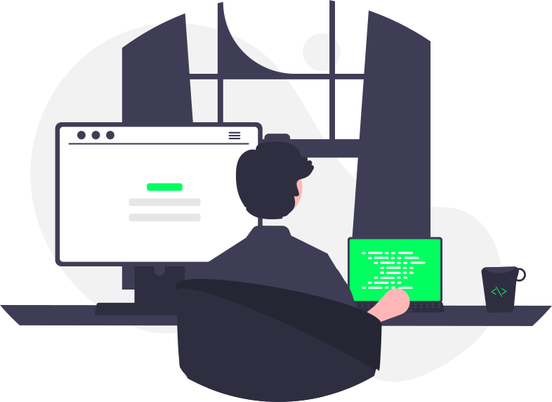

  

  
 👨🏻‍💻 Olá, meu nome é Luan Costa e sou <b>Desenvolvedor Laravel</b>. Estou cursando 
    Ensino Superior de <b>Tecnologia em Análise e Desenvolvimento de Sistemas</b> 
    no Centro Universitário SENAC - Santo Amaro.

   
  
 ☕ Habilidades: <b>HTML, CSS, PHP, MySQL, Laravel e Versionamento com Git</b>.

   
  
 🧡 Desenvolvedor Estagiário na <b>ImóvelP</b>.

  ##
 

  
  
   
   

